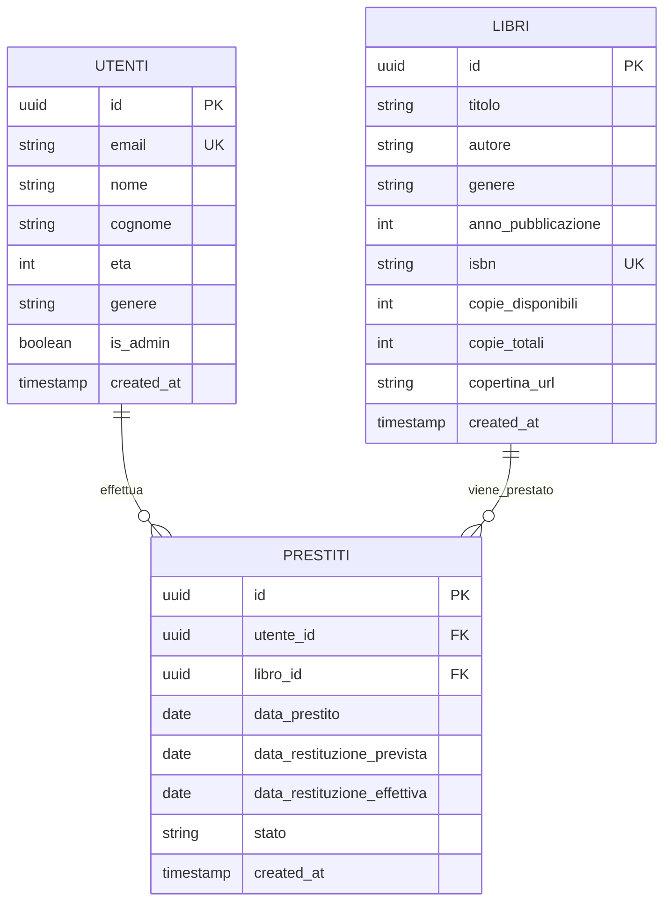

<div align="center">

# 📚 Vellum Library Management System

### *Sistema di gestione libreria moderno e completo*

[](https://react.dev/)
[](https://www.typescriptlang.org/)
[](https://tailwindcss.com/)
[](https://supabase.com/)
[](https://vercel.com/)


---

</div>

---

## 🎯 Panoramica

**Vellum** è un sistema di gestione libreria full-stack che offre un'esperienza moderna e intuitiva sia per gli amministratori che per gli utenti finali. Con autenticazione OAuth, interfaccia 3D interattiva e dashboard analitiche, Vellum ridefinisce la gestione delle biblioteche digitali.

### ✨ Caratteristiche Distintive

<table>
<tr>
<td width="50%">

#### 🎨 **Design Moderno**
- Interfaccia fluida con animazioni Liquid Ether
- Visualizzazione 3D del catalogo libri
- Dark mode e tema personalizzabile
- Responsive design per tutti i dispositivi

</td>
<td width="50%">

#### 🔐 **Autenticazione Avanzata**
- Login/Registrazione classica
- OAuth 2.0 con Google
- Profilo utente completabile step-by-step
- Sistema di ruoli (Admin/Cliente)

</td>
</tr>
<tr>
<td width="50%">

#### 📊 **Analytics & Insights**
- Dashboard statistiche real-time
- Grafici interattivi con Recharts
- Tracciamento prestiti e disponibilità
- Report esportabili

</td>
<td width="50%">

#### ⚡ **Performance**
- Build ottimizzato con Vite
- Lazy loading componenti
- Cache strategica con Supabase
- Deploy automatico su Vercel

</td>
</tr>
</table>

---

---

## 🚀 Quick Start

<details open>
<summary><b>Installazione Rapida (3 minuti)</b></summary>

<br>

**1️⃣ Clona il repository**
```bash
git clone https://github.com/Yamino00/MyLibrary.git
cd MyLibrary
```

**2️⃣ Installa le dipendenze**
```bash
npm install
```

**3️⃣ Configura l'ambiente**
```bash
cp .env.example .env
# Modifica .env con le tue credenziali Supabase
```

**4️⃣ Avvia il progetto**
```bash
npm run dev
```

🎉 **Apri** [http://localhost:5173](http://localhost:5173) **nel browser!**

</details>

<details>
<summary><b>Setup Completo con Database</b></summary>

<br>

Per una guida dettagliata su configurazione Supabase, migrations e deploy:
- 📖 [Guida Setup Completa](./GUIDA_SETUP.md)
- ✅ [Checklist Implementazione](./CHECKLIST.md)
- 📋 [Documentazione Tecnica](./IMPLEMENTAZIONE_COMPLETATA.md)

</details>

---

---

## 💎 Funzionalità Principali

<div align="center">

### 👨‍💼 Portale Admin

</div>

| Modulo | Funzionalità | Stato |
|--------|-------------|-------|
| 📊 **Dashboard** | Statistiche real-time, KPI, grafici interattivi | ✅ |
| 📚 **Gestione Libri** | CRUD completo, upload copertine, import automatico | ✅ |
| 👥 **Gestione Utenti** | Visualizzazione, modifica ruoli, storico attività | ✅ |
| 📖 **Gestione Prestiti** | Creazione, tracking, restituzione, promemoria | ✅ |
| 📈 **Analytics** | Report esportabili, trend analysis, insights | ✅ |

<div align="center">

### 👤 Portale Clienti

</div>

| Funzione | Descrizione | Stato |
|----------|-------------|-------|
| 🔍 **Catalogo 3D** | Visualizzazione immersiva con Three.js | ✅ |
| 🔎 **Ricerca Avanzata** | Filtri per titolo, autore, genere, disponibilità | ✅ |
| 📥 **Richiesta Prestiti** | Sistema one-click con notifiche real-time | ✅ |
| 📋 **I Miei Prestiti** | Storico personale, date scadenza, rinnovi | ✅ |
| 👤 **Profilo** | Gestione account, preferenze, statistiche personali | ✅ |

---

---

## 🛠️ Stack Tecnologico

<div align="center">

### Frontend

[](https://react.dev/)
[](https://www.typescriptlang.org/)
[](https://vitejs.dev/)
[](https://tailwindcss.com/)

[](https://reactrouter.com/)
[](https://threejs.org/)
[](https://motion.dev/)
[](https://recharts.org/)

### Backend & Database

[](https://supabase.com/)
[](https://www.postgresql.org/)

### Deployment & Tools

[](https://vercel.com/)
[](https://eslint.org/)
[](https://postcss.org/)

</div>

---

---

## 📁 Architettura del Progetto

```
MyLibrary/
│
├── 📂 src/
│   ├── 🎨 components/          # Componenti riutilizzabili
│   │   ├── Navbar.tsx          # Navigazione con ruoli
│   │   ├── ProtectedRoute.tsx  # Route guards
│   │   ├── Stepper.tsx         # Multi-step form animato
│   │   └── LiquidEther.tsx     # Background animato 3D
│   │
│   ├── 🔌 contexts/            # State management globale
│   │   └── AuthContext.tsx     # Gestione autenticazione
│   │
│   ├── 🪝 hooks/               # Custom React hooks
│   │   └── useAuth.ts          # Hook per auth
│   │
│   ├── ⚙️ lib/                 # Configurazioni
│   │   └── supabase.ts         # Client Supabase
│   │
│   ├── 📄 pages/               # Pagine applicazione
│   │   ├── 🔐 Auth/
│   │   │   ├── Login.tsx
│   │   │   ├── Register.tsx
│   │   │   ├── AuthCallback.tsx
│   │   │   └── CompleteProfile.tsx
│   │   │
│   │   ├── 👤 Client/
│   │   │   ├── ClientHome.tsx
│   │   │   └── ClientLoans.tsx
│   │   │
│   │   └── 👨‍💼 Admin/
│   │       ├── AdminDashboard.tsx
│   │       ├── AdminBooks.tsx
│   │       ├── AdminUsers.tsx
│   │       ├── AdminLoans.tsx
│   │       ├── AdminStats.tsx
│   │       └── AdminImportBooks.tsx
│   │
│   ├── 📦 types/               # TypeScript definitions
│   │   └── index.ts
│   │
│   ├── 🎯 services/            # API & External services
│   │   ├── deeplService.ts     # Traduzione automatica
│   │   └── openLibraryService.ts
│   │
│   ├── App.tsx                 # Router principale
│   └── main.tsx                # Entry point
│
├── 📂 supabase/
│   ├── functions/              # Edge Functions
│   └── Migration/              # Database migrations
│
├── 📂 public/                  # Assets statici
├── 📄 vercel.json              # Config Vercel
└── 📋 README.md                # Questo file
```

---

---

## 🗄️ Schema Database

<div align="center">



</div>

### Caratteristiche Database

- ✅ **Row Level Security (RLS)** - Politiche di accesso granulari
- ✅ **Trigger Automatici** - Gestione disponibilità libri
- ✅ **Relazioni Referenziali** - Integrità dei dati garantita
- ✅ **Indici Ottimizzati** - Query performanti
- ✅ **Seed Data** - 10 libri pre-caricati per testing

**Migration Files**: [`supabase/Migration/`](./supabase/Migration/)

---

---

## ⚙️ Configurazione

### 🔧 Setup Supabase

<details>
<summary><b>1. Crea un Progetto Supabase</b></summary>

<br>

1. Vai su [supabase.com](https://supabase.com) e crea un account
2. Crea un nuovo progetto
3. Copia **Project URL** e **Anon Public Key**

</details>

<details>
<summary><b>2. Esegui le Migrations</b></summary>

<br>

Nel **SQL Editor** di Supabase, esegui in ordine:

```sql
-- 001: Schema iniziale (utenti, libri, prestiti)
-- 002: Trigger creazione utente
-- 003-009: Fix e ottimizzazioni
```

Oppure esegui il file completo: [`supabase-schema.sql`](./supabase-schema.sql)

</details>

<details>
<summary><b>3. Configura OAuth Google</b></summary>

<br>

**Supabase Dashboard** → **Authentication** → **Providers**

- ✅ Abilita **Google Provider**
- Aggiungi **Redirect URLs**:
  - `http://localhost:5173/auth/callback`
  - `https://your-domain.vercel.app/auth/callback`

</details>

### 🔐 Variabili d'Ambiente

Crea `.env` nella root:

```env
VITE_SUPABASE_URL=https://xxxxxxxxxxxx.supabase.co
VITE_SUPABASE_ANON_KEY=eyJhbGciOiJIUzI1NiIsInR5cCI6IkpXVCJ9...
```

### 👑 Crea il Primo Admin

Nel **SQL Editor** di Supabase:

```sql
UPDATE utenti 
SET is_admin = TRUE 
WHERE email = 'tuo-email@example.com';
```

---

---

## 🚀 Deployment

### Deploy su Vercel (Raccomandato)

<div align="center">

[](https://vercel.com/new/clone?repository-url=https://github.com/Yamino00/MyLibrary)

</div>

<details>
<summary><b>Deploy Manuale</b></summary>

<br>

**1. Collega Repository GitHub**
```bash
git remote add origin https://github.com/Yamino00/MyLibrary.git
git push -u origin main
```

**2. Importa su Vercel**
- Vai su [vercel.com/new](https://vercel.com/new)
- Seleziona il repository
- Configura le variabili d'ambiente

**3. Variabili d'Ambiente Vercel**
```
VITE_SUPABASE_URL=https://xxxx.supabase.co
VITE_SUPABASE_ANON_KEY=eyJhbGciOiJI...
```

**4. Deploy!**
- Vercel effettua il build automaticamente
- Ogni push su `main` triggera un nuovo deploy

</details>

### Build Locale

```bash
# Build di produzione
npm run build

# Preview build locale
npm run preview
```

Output in `dist/` pronto per qualsiasi hosting statico.

---

---

## 📊 Stato Implementazione

<div align="center">

### Progress Overview


</div>

| Categoria | Features | Stato | Progresso |
|-----------|----------|-------|-----------|
| 🏗️ **Setup Progetto** | Vite, TypeScript, Tailwind | ✅ |  |
| 🗄️ **Database** | Schema, RLS, Trigger, Seed | ✅ |  |
| 🔐 **Autenticazione** | Login, OAuth, Profilo | ✅ |  |
| 📚 **CRUD Libri** | Creazione, Modifica, Eliminazione | ✅ |  |
| 👥 **CRUD Utenti** | Gestione ruoli, Visualizzazione | ✅ |  |
| 📖 **CRUD Prestiti** | Creazione, Tracking, Restituzione | ✅ |  |
| 👤 **Portale Clienti** | Catalogo 3D, Ricerca, Prestiti | ✅ |  |
| 📊 **Dashboard Admin** | Statistiche, Grafici, Analytics | ✅ |  |
| 🎨 **UI/UX** | Animazioni, Responsive, A11y | ✅ |  |
| 🚀 **Deploy** | Vercel, Ottimizzazioni | ✅ |  |

---

---

## 🎯 Requisiti del Progetto

<table>
<tr>
<td width="50%" valign="top">

### ✅ Requisiti Base

- ✅ Database relazionale (PostgreSQL)
- ✅ Entità: Utenti, Libri, Prestiti
- ✅ Relazioni e vincoli di integrità
- ✅ GUI per operazioni CRUD
- ✅ Web App React + Tailwind CSS
- ✅ Sistema di autenticazione
- ✅ Gestione errori e feedback

</td>
<td width="50%" valign="top">

### ⭐ Funzionalità Avanzate

- ✅ **FA1** - Portali separati Admin/Clienti
- ✅ **FA2** - Dataset pre-caricato (10 libri)
- ✅ **FA4** - Dashboard con statistiche
- ✅ **FA6** - Gestione eccezioni robusta
- 🔜 **FA3** - Multi-lingua (i18next)
- 🔜 **FA5** - Chatbot AI integrato

</td>
</tr>
</table>

---

## 🧪 Testing

Per testare tutte le funzionalità, segui la **[Checklist Completa](./CHECKLIST.md)**:

<details>
<summary><b>Test Checklist Rapida</b></summary>

<br>

- [ ] ✅ Registrazione nuovo utente
- [ ] ✅ Login con email/password
- [ ] ✅ Login con Google OAuth
- [ ] ✅ Completamento profilo OAuth
- [ ] ✅ Visualizzazione catalogo clienti
- [ ] ✅ Ricerca e filtri libri
- [ ] ✅ Richiesta prestito
- [ ] ✅ Accesso admin dashboard
- [ ] ✅ CRUD libri completo
- [ ] ✅ CRUD utenti completo
- [ ] ✅ CRUD prestiti completo
- [ ] ✅ Visualizzazione statistiche
- [ ] ✅ Responsive design mobile
- [ ] ✅ Protezione route
- [ ] ✅ Gestione errori

</details>

---

---


## 🤝 Contribuire

Questo progetto è sviluppato come progetto didattico. Contributi sono benvenuti!

<details>
<summary><b>Come Contribuire</b></summary>

<br>

1. **Fork** il repository
2. **Crea** un branch per la tua feature (`git checkout -b feature/AmazingFeature`)
3. **Commit** le modifiche (`git commit -m 'Add some AmazingFeature'`)
4. **Push** al branch (`git push origin feature/AmazingFeature`)
5. **Apri** una Pull Request

</details>

### 💡 Idee per Contributi

- [ ] Implementazione multi-lingua (i18next)
- [ ] Chatbot AI con accesso database
- [ ] Sistema di notifiche push
- [ ] Export PDF report prestiti
- [ ] Sistema di recensioni libri
- [ ] Raccomandazioni AI basate su preferenze

---

## 📄 Licenza

Questo progetto è rilasciato sotto licenza **MIT**.

Vedi [LICENSE](./LICENSE) per maggiori dettagli.

---

## 🎉 Crediti & Ringraziamenti

<div align="center">

Sviluppato con ❤️ utilizzando tecnologie moderne

[](https://react.dev/)
[](https://www.typescriptlang.org/)
[](https://supabase.com/)
[](https://tailwindcss.com/)
[](https://vercel.com/)

### 🌟 Special Thanks

- [React Team](https://react.dev/) - Framework UI
- [Supabase](https://supabase.com/) - Backend as a Service
- [Vercel](https://vercel.com/) - Hosting & Deploy
- [Three.js](https://threejs.org/) - Rendering 3D
- [Recharts](https://recharts.org/) - Data Visualization
- [Tailwind Labs](https://tailwindcss.com/) - CSS Framework

---

<p align="center">
  <strong>⭐ Se ti piace questo progetto, lascia una stella su GitHub! ⭐</strong>
</p>

<p align="center">
  Made with 💙 by <a href="https://github.com/Yamino00">@Yamino00</a>
</p>

<p align="center">
  <sub>Progetto didattico - 2025</sub>
</p>

</div>
